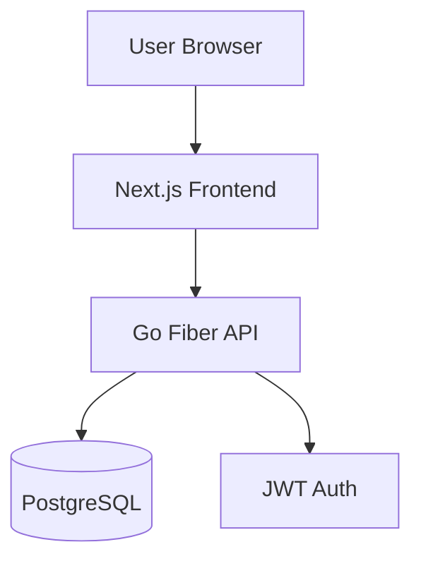
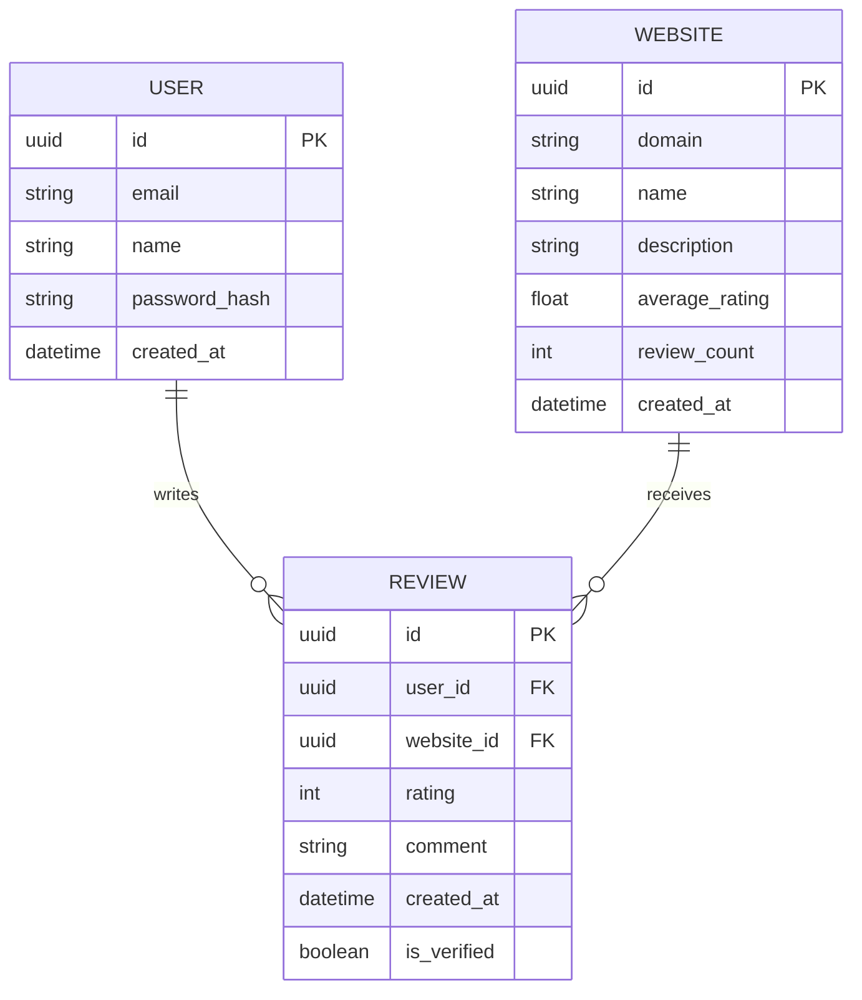

# Etemademan (اعتمادمن) - Technical Specification & Plan (Go Fiber + Next.js)

## Project Overview

Etemademan is a review platform similar to Trustpilot, where users can search for websites, read reviews, and leave their own ratings and comments. The platform supports multiple languages (starting with Persian and English).

## Technical Stack

- **Frontend:** Next.js 15 (App Router), TypeScript, Tailwind CSS, Shadcn UI
- **Backend:** Go (Golang) with **Fiber** framework
- **Architecture:** Clean Architecture (Entities, Use Cases, Repositories, Handlers)
- **API Style:** RESTful API
- **Database:** PostgreSQL
- **Authentication:** JWT (JSON Web Tokens)
- **Internationalization:** `next-intl` for frontend, localized error messages from backend

## System Architecture

## Clean Architecture (Backend)

- **Domain/Entities:** Core business objects (User, Website, Review).
- **Usecases:** Business logic (e.g., "Submit a Review", "Calculate Average Rating").
- **Repositories:** Interface for data persistence.
- **Handlers:** Fiber HTTP handlers for routing and request/response mapping.

## Database Schema (Conceptual)

## API Endpoints (Go Fiber)

- `GET /api/v1/websites?q=...`: Search for websites.
- `GET /api/v1/websites/:domain`: Get website details.
- `GET /api/v1/websites/:id/reviews`: Get reviews for a website.
- `POST /api/v1/reviews`: Create a new review (Auth required).
- `POST /api/v1/auth/register`: User registration.
- `POST /api/v1/auth/login`: User login.

## Internationalization (i18n) Strategy

- **Frontend:** Sub-path routing (`/fa`, `/en`). RTL support for Persian.
- **Backend:** Accept `Accept-Language` header to return localized error messages.

## Project Structure

- `/frontend`: Next.js application.
- `/backend`: Go application (Fiber).
  - `/internal/domain`: Entities and Repository interfaces.
  - `/internal/usecase`: Business logic.
  - `/internal/repository`: Database implementation (SQL).
  - `/internal/handler`: Fiber HTTP handlers.
  - `/cmd/api`: Entry point.
- `/plans`: Documentation and planning.

1. Initialize Go backend with Fiber and Clean Architecture folders.
2. Initialize Next.js frontend with `next-intl`.
3. Setup Docker Compose for PostgreSQL.
4. Implement User Authentication (JWT).
5. Implement Website Search and Review submission.
